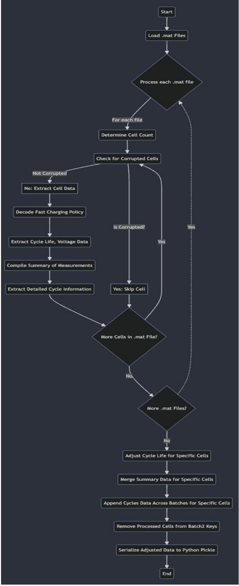
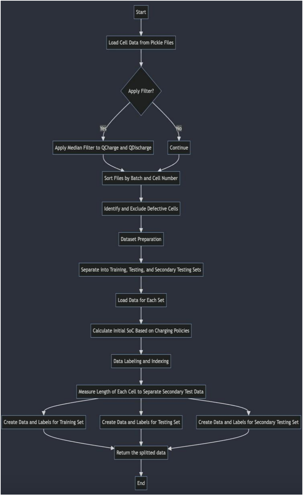
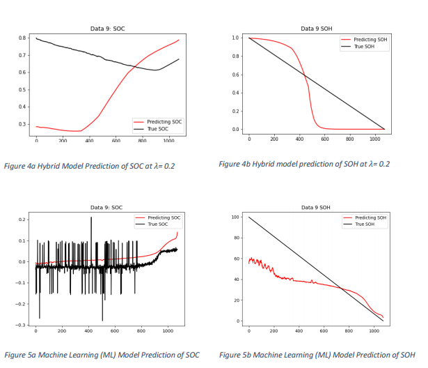

# Lithium Battery Health Prediction using neural ordinary differential equation

## Introduction
Lithium batteries, a cornerstone of modern portable electronics, electric vehicles, and renewable energy
storage systems, exhibit complex, non-linear behaviors that significantly impact their performance and
lifespan. Central to understanding a battery's operational status are the concepts of State of Charge (SOC)
and State of Health (SOH). SOC indicates the current charge level relative to the battery's capacity, while
SOH reflects the battery's overall condition and its ability to hold a charge over time. Accurately predicting
a lithium battery's health is crucial, as it directly influences maintenance schedules, safety protocols, and
the efficient management of energy resources. However, the challenge lies in the battery's non-linear
degradation patterns and the wide variability in life cycles, influenced by factors such as charge/discharge
rates, temperature, and usage history. Predicting battery life and health enables proactive maintenance,
enhances reliability, and optimizes performance, opening doors to more sustainable energy usage, longer
battery life spans, and reduced environmental impact. The ability to precisely forecast battery SOH and
SOC not only ensures the operational integrity of systems relying on these power sources but also
supports the advancement of green technology and sustainable practices.
Traditional deep learning models, including RNNs and LSTMs, often struggle with the non-linear dynamics
and long-term dependencies characteristic of time-series data. This limitation becomes particularly
evident in applications requiring efficient modeling of continuous-time data, such as predicting the health
of lithium batteries. In contrast, Neural Ordinary Differential Equation (NODE) models emerge as a
powerful alternative, seamlessly integrating with the continuous nature of such data. By employing
differential equations, NODEs adeptly capture complex dynamics with fewer parameters and reduced
computational overhead, enhancing data efficiency. This concise and elegant approach not only
streamlines the prediction process but also offers significant advantages in applications with complex
behaviors and irregular sampling rates. Consequently, NODEs hold great potential for improving the
accuracy of battery health predictions, facilitating more effective maintenance strategies, and
contributing to the advancement of sustainable energy technologies.
In this work, a novel hybrid model combining Neural Ordinary Differential Equations (NODE) with
advanced deep learning techniques is proposed. This model uniquely integrates dynamic system guidance
to direct the update of model weights, specifically addressing the non-linear prediction challenges
associated with lithium battery health degradation. This approach marks a significant advancement in
time-series predictive modeling, particularly for energy storage systems.
## Dataset
This study utilizes a dataset comprising 124 commercial lithium-ion phosphate/graphite cells
(A123 Systems APR18650M1A), subjected to fastcharging protocols and cycled to failure. Conducted
at 30°C, these tests utilized a 72 fast charging policy,
with charging phases delineated by specific SOC
percentages and concluded with a constant currentconstant voltage (CC-CV) phase until reaching 80%
SOC. The dataset, divided into three batches,
captures comprehensive cycle data, including
temperature measurements via Type T
thermocouples and internal resistance readings.
Despite some irregularities and measurement
inconsistencies corrected in the data structure, the
dataset provides a robust foundation for optimizing
fast-charging strategies for lithium-ion batteries.
Moreover, the dataset, available in .mat format,
necessitates a strategic approach for data extraction
and preprocessing to ensure its readiness for model
input.

## Methodology
In this section, we discussed the data extraction,
data pre-processing, model architecture and loss
function.
### Data Extraction
The data extraction process, detailed in Figure 1,
involves a meticulous procedure to prepare lithiumion battery data from .mat files for predictive
modeling. After loading the data and filtering out
corrupted cells, it decodes fast charging policies and
extracts essential metrics such as cycle life, voltage
data, and compiles summaries for each cell. These
summaries include key variables like internal
resistance (IR), charge and discharge capacities
(QCharge, QDischarge), and temperature
measurements. For specific cells, the process adjusts
cycle life and merges summary and detailed cycle
data across batches, enhancing dataset accuracy and
completeness. The final step stored the processed data into Python pickle files, setting a solid foundation
for subsequent analysis.
### Data Preparation:
The data preparation process, detailed in
Figure 2, begins with loading lithium-ion
battery data from Python pickle files and
optionally applies a median filter to smooth
charge and discharge capacities. By sorting
the files by batch and cell number and
meticulously excluding defective cells, the
integrity of the dataset is preserved. The
methodology further involves aggregating
and labeling data, considering both current
and historical metrics for each cell. This
careful compilation and refinement of data,
inclusive of initial State of Charge (SoC)
calculations, culminate in structured datasets
poised for predictive modeling. This
streamlined approach ensures the dataset's
completeness and reliability, essential for the
accurate prediction of battery performance.

### Model Architecture:
The proposed model architecture as shown
in Figure 3, is a cutting-edge hybrid
framework designed to predict the State of
Health (SOH) and State of Charge (SOC) of
lithium-ion batteries. It intelligently
integrates two distinct branches: a machine
learning (ML) neural branch and a Neural
Ordinary Differential Equation (NODE)
branch. This dual-branch design leverages
the strengths of deep learning to recognize
patterns in the data, alongside the precision
of system differential representation to
model the battery's dynamics over time.

## Experiment settings:
In this study, set up a series of parameters to evaluate the performance of our hybrid neural network
model, which integrates both Neural Network (NN) and Neural Ordinary Differential Equation (NODE)
components for predicting the State of Health (SOH) and State of Charge (SOC) of lithium-ion batteries.
Data extraction and preparation phases form the groundwork, where cell data is processed and prepared
for training and testing. A learning rate of 1×10−3, and the model was trained over 50 epochs with a batch
size of 16, balancing computational efficiency with the need for accurate gradient estimation. The model's
architecture is tailored to predict SOH and SOC from 11 input features, representing various battery
performance metrics. A key aspect of the approach is the use of a hybrid loss function, balanced by a
lambda 𝜆 value of 0.2, to integrate the predictive capabilities of both the NN and NODE branches.
Additionally, in this work for training, train and test data are merged and used during training and
secondary test data is utilized for testing the model's predictive accuracy, ensuring its robustness and
reliability across different battery datasets.
## Gradient Update Process:
The training of the hybrid model hinges on a critical step known as the gradient update, which fine-tunes
the model parameters for better accuracy. This process involves two key TensorFlow features: custom
gradients and Gradient Tape. Custom gradients, defined using @tf.custom_gradient, allow us to specify
how gradients should be calculated in complex scenarios, such as when modeling with differential
equations that represent battery dynamics. The Gradient Tape, on the other hand, records computational
operations to automatically compute these gradients.
During training, Gradient Tape tracks the model's predictions and compares them with actual data to
calculate the loss. It then computes the gradients of this loss relative to the model parameters. Finally,
these gradients are used to update the model parameters, gradually improving the model’s performance.
Following are the steps followed during gradient update:
1. Begin Gradient Update
2. Initialize GradientTape to monitor operations
3. Perform forward pass:
4. - Solve ODEs with solver.solve() for battery dynamics
5. - Make predictions with the neural network model
6. Calculate loss between predictions and true data
7. Use GradientTape to compute gradients of the loss with respect to model parameters
8. Apply gradients to model parameters using an optimizer RMSprop
9. Repeat steps 3-8 for each batch of data in each epoch
10. End Gradient Update
## Result:

## Contributors

Feel free to contribute to this project by creating a pull request. If you have any questions or suggestions, please open an issue.
Please cantact if any issues. aitechguy0105@gmail.com
Thank you for checking out this demo project!